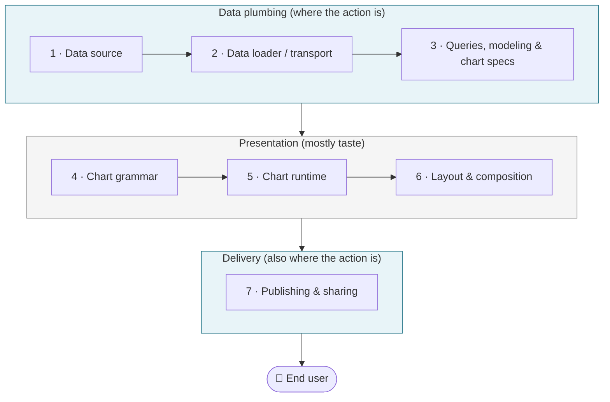

# the jagged edge of agentic analytics

I didn't set out to make [this bakeoff of static dashboards](https://dashboard-bakeoff.anders.omg.lol/)! My original goal was to experiment having agents create a toy end-to-end analytics project on a real, "small" dataset.

Caveat upfront: I'm not a web developer. I came to this from years of Power BI and dbt, with a soft spot for static-site generators because they make me feel like I'm building a Xanga page in 2004. This post is part architecture sketch, part field notes — and it ends with more questions than I started with.

The source data, [dbt-labs/dbt-fusion](https://github.com/dbt-labs/dbt-fusion) issues, is near and dear to my heart. I used [`dlt`](https://github.com/dlt-hub/dlt) to extract the raw data from GitHub to MotherDuck, dbt to model the data, then created a dashboard with [Prefab](https://prefab.prefect.io/docs/welcome) because it was new and made by Jeremiah Lowin and others at Prefect who are always doing cool AI things.

I was surprised to discover this project evolve into an audit of the various static site dashboarding frameworks I knew of.

Before getting into the "meta" of HTML dashboards, I will first say that dlt and motherduck are incredible for this use case. I've zero bugs with either tool over the past few weeks. Y'all should consider using them if you have a use case (and dbt ofc)! But these tools were a means to an end here for me.

What did I learn? What frameworks do I prefer? I'm really hard-pressed to say, mainly because agents did all the work, I wrote absolutely zero of the code nor did I read any of the framework's docs. Once the basic structure was setup, the last few dashboards were with a simple prompt: "add a new tab to the bakeoff for {new framework}."

After 9+ frameworks were lined up side-by-side, I found myself (yet again) on a philosophical kick with big questions like these:

1. what are the shared standard components of this static dashboard stack?
2. if static dashboards take off, where will they be consumed: in a browser tab or inside of an agent chat terminal? and if it's the latter, what does it even mean to "refresh" a dashboard?
3. do we want dashboards to be static for simplicity's sake? or do we want live data and interactivity at the cost of complexity?
4. when agents are the ones authoring dashboards, what's the best target format for them — JSON specs, SQL-first DSLs, Markdown + SQL, Python notebooks? I have hunches, no data.

Benn Stancil's [how do you make a chart](https://benn.substack.com/p/how-do-you-make-a-chart) from last week does a good job of sketching out the spectrum of possible outcomes for BI in the agentic era: at what level of abstraction do you ask the AI to engage? Excel? Javascript? a popular charting library? a self-created DSL for data visualization? It serves as an apt metaphor for reasoning how broadly and deeply AI will find a place in our economy.

My question is much more simple:
> If dashboards are here to stay and are embraced by human-guided agents, what does this "stack" look like?

Also, what's missing from the stack as is? Compared to current BI offerings, these dashboards come across as rather rudimentary. There's hardly any bell-and-whistle table stakes features we expect all "real" BI tools to have: no single sign-on and RBAC, no drag-and-drop chart creator, no Export to PDF. But how much of this is really needed here?

## Layers

Below an emerging anatomy of what a dashboard really contains under the hood. If this sounds both overly simplistic and overly pedantic, you'd be right!

| # | Layer | What it does |
|---|---|---|
| 1 | **Data source** | Where the cleaned data actually lives |
| 2 | **Data loader / transport** | How the dashboard gets data into the page |
| 3 | **Data queries, semantic modeling & chart specifying** | What metrics exist, and how each chart selects from them |
| 4 | **Chart grammar** | The DSL for *what* a chart should be (Vega-Lite spec, Plot config, etc.) |
| 5 | **Chart runtime** | What renders the grammar into pixels |
| 6 | **Layout & composition** | How charts arrange themselves on the page |
| 7 | **Publishing & sharing** | Where the dashboard lives once it's built, and how end users actually consume it |

Or, drawn out:



I started this work thinking layers 4–6 (chart grammar, runtime, layout) were the whole game. Turns out the three things I can't stop thinking about are layer 2 (how data gets loaded, and whether it has to be frozen), layer 3 (keeping metric definitions out of chart code — especially when agents are writing it), and layer 7 (auth and where the dashboard actually lives).

### Layer 1 (data source): MotherDuck is genuinely sick

You dataset needs to be somewhere. Even in the era of AI you need a system of record, you don't want to have an agent create a database for you. In this expamle I used dlt to extract from GitHub to Motherduck. Worked great!

Moving on.

### Layer 2 (data transport): this is where I'm stuck

Of the nine variants in the bakeoff, eight do the same basic thing: at build time, run SQL against the warehouse, dump the results into a flat file (JSON, CSV, Parquet), and bake that file into the static site. Evidence.dev does something slightly different: SQL still runs at build time, but instead of embedding results directly in the page, it ships them as Parquet files alongside the HTML. Then DuckDB-WASM runs in the browser and lets you filter and aggregate over those Parquet files without touching a server. The data is still frozen at build time — but the browser-side query layer means interactive filtering without a roundtrip.

| Mode | What happens | Frameworks in the bakeoff |
|---|---|---|
| Build-time bake | SQL runs in CI; results get written into the static artifact | Prefab, mviz, MDV, ggsql, Observable, Marimo, Quarto |
| Build-time bake + browser-side querying | SQL runs at build time; browser queries frozen Parquet via DuckDB-WASM | Evidence.dev |

Both share the same fundamental problem: the data is frozen at build time. "Refresh the dashboard" means "rerun the build and redeploy."

That's fine for a lot of cases — a nightly build-and-deploy isn't that different from a nightly refresh in Tableau. I'm genuinely not sure where the line is between "frozen data is fine" and "you actually need live queries." It probably depends on how stale your data can be and whether users need to filter on dimensions that weren't pre-aggregated. I don't have strong opinions on this yet. The shape I keep sketching in my head, for an unfrozen version, is something like:

```
data source + dashboard infra → on dashboard load:
  1. live-query the data source with the user's creds
  2. render the dashboard into the page
```

Which, if you squint, is just Looker or Mode or Power BI's "live query" mode. The HTML is "static" in the sense that the dashboard *spec* is static and versionable, but the data is fetched fresh every time. None of the nine frameworks I tried do this cleanly today; most are committed to one mode or the other, and the live-query path basically doesn't exist outside of full SaaS BI tools.

What I'd want from a "good" stack is the ability to start with build-time bake (because it's simple, cacheable, and the static artifacts are diffable), then promote individual queries to render-time when they actually need it — *without rewriting the dashboard*. That doesn't exist yet either.

### Layer 3 (data queries, semantic modeling, and chart specifying): three things wearing one hat

A hard truth I relearned in this project:
> dashboards are black holes that inevitably suck business logic into them regardless if they are human- or machine-authored

Every framework has some affordance — a code block, a transform step, a chart-config knob — that makes it slightly faster *in the moment* to fix a metric definition or filter or label inside the dashboard than to push it back into the dbt layer where it belongs. And every time you do, you've quietly turned the dashboard into a parallel, undocumented semantic layer.

I have to admit that, as a dbt Labs employee and general dbt zealot, it isn't a cardinal sin to have business logic in a dashboard. I can understand why folks do it.

The reason this layer is so cursed is that there are actually *three* different things going on inside it, and most frameworks blur them into one undifferentiated "write some code that produces a chart" affordance:

- **Semantic modeling** is "what is a metric, what dimensions can slice it, how do entities join, what does *churn* mean in this company." It's the contract layer. It belongs in dbt (or whatever owns your semantic layer).
- **Data queries** are "for this specific chart, give me the rows I need" — a `SELECT` over the modeled tables. Filters, time grain, group-bys. It can live in the dashboard repo, but it should be a thin selection over the contract above, not a place to *redefine* the contract.
- **Chart specifying** is "this metric goes on the y-axis, this dimension goes on the x-axis, color by repo, render as a line." It's an encoding declaration. It belongs *with* the chart, but it shouldn't be doing math.

A healthy Layer 3 says things like *"give me weekly active issues, broken down by repo, for the last 90 days, as a line chart."* It does **not** say *"`SELECT CASE WHEN status IN ('open', 'reopened') THEN 1 ELSE 0 END ...`"* — that's a metric definition leaking into the chart spec, and once you have one of those, you'll have fifty.

The reason agents (and humans) drift the wrong way is that the second kind of code is *easier to write in the moment* than going back and fixing the dbt model. A good authoring layer makes the easy path the right one: the chart spec can name a metric, but it cannot *define* one. Looker famously got bitten by the inverse — a long tail of dashboard-specific edge cases got jammed into LookML because there wasn't a clean place for last-mile shaping, and the semantic layer slowly turned into a junk drawer. And you get the opposite failure if the semantic layer is too rigid: dashboards become the junk drawer for anything that doesn't fit the model. A good Layer 3 lets last-mile *presentation* tweaks happen in the dashboard (rename a label, sort differently, change a date format) while pushing anything that touches *meaning* back upstream.

I don't think any of the nine frameworks I tried gets this fully right. The closest are the ones where the chart spec is genuinely a thin SQL `SELECT` against pre-modeled tables; the worst are the ones that hand the agent a Python notebook and a CSV and say "good luck."

One thread worth pulling: a DSL with mature language tooling — validation, static analysis, diagnostics — may be the structural answer to keeping agents in bounds here, not just a matter of authoring convention. Python and JavaScript are powerful but open-ended in ways that make it easy for an agent to produce output that's valid syntax but semantically wrong. A constrained DSL with a language server can catch that before it hits a warehouse. SQL already has this property to a degree; tools like dbt Fusion are pushing it further with type-aware static analysis that validates queries regardless of whether a human or a machine wrote them. My intuition is that "which frameworks are most agent-friendly at Layer 3" and "which frameworks have the richest language tooling" are going to turn out to be the same question.

### Layers 4–6: mostly where opinions live — at least at my scale

I'm going to move past chart grammar, chart runtime, and layout pretty quickly because *in my bakeoff* these layers felt like they mattered less than I expected. Agents handled all nine variants with roughly equal ease. The output looks different, but the *amount of work to get a working dashboard* was surprisingly constant across the lot.

That said — I'd push back on myself here in two ways.

First, the scale caveat: my project was one person, one dataset, simple prompts. That's not a team workflow and it's not a complex dashboard with drill-downs and 40 charts. Someone with a more rigorous methodology or more ambitious requirements might find these layers jagged in ways I didn't hit.

Second, the ceiling caveat, which is sharper: I was measuring *how much work did the agent do*, not *what's the highest ceiling the agent could reach*. Traditional BI tools typically offer a fixed menu of chart types. One of the actual promises of agentic authoring is generating *anything* — novel forms, bespoke layouts, visualizations no chart picker would ever surface. My toy dataset never needed that. So I haven't tested that ceiling at all, and that ceiling might be exactly where these layers get jagged in ways that matter.

What I can say is: Jacob's `mviz` has clear, opinionated defaults that are gorgeous out of the box, Prefab let me theme an entire dashboard like a Windows 2000 desktop, and Quarto absolutely owns the narrative-report end of the spectrum. The differentiation here is about taste and authoring vibe. If your goal is "ship something that loads and shows the right numbers," all of these got me there — but your mileage may vary once the requirements get real.

The decision guide on the [bakeoff about page](https://dashboard-bakeoff.anders.omg.lol/?tab=about) lays out which to pick if you have a specific need. I'm not going to repeat it here.

### Layer 7 (publishing & sharing): the layer everyone forgot about

This is the layer I was sleeping on for the first half of the bakeoff. I kept treating "publish" as a footnote — `make build && push to GitHub Pages, done`. That's wrong. The surface a dashboard lives on, and the auth model around it, completely change what the dashboard is *for*.

There are basically three surfaces a static dashboard can live on today, and each one has a different shape:

| Surface | Looks like | Auth story today |
|---|---|---|
| Web browser at a URL | The classic Looker/Mode/Tableau experience, but flatter | "Public on the internet" or "behind a corporate VPN/SSO via your BI vendor" |
| MCP app inside an agent | "Tell Claude to load the marketing WBR dashboard" | The agent client handles auth; the dashboard inherits it |
| Image or PDF dropped in Slack | A baked snapshot, no interactivity | None needed — it's just a file |

All three are real, and each one is the right answer for some set of users. None of the nine frameworks I tried treats this layer as a first-class concern though.

#### The MCP-app argument

Jacob has been making the case for a while that the future of dashboard distribution looks less like "send your coworker a URL" and more like "tell your agent to load this dashboard." His [mviz](https://github.com/matsonj/mviz) has an MCP server in the works that does exactly this, and MotherDuck's Dives are already loadable as MCP apps from inside Gemini and Claude.

I buy it as a UI distribution channel. The argument is basically: if everyone is going to be talking to an agent all day anyway, the agent becomes the new operating system, and dashboards are just one more thing the agent can pull up. Browser tabs become legacy.

The reason it took me a while to come around is that I was conflating layer 7 (where do users see this thing?) with layer 2 (how does this thing get its data?). They're two different questions. "Dashboard lives in an MCP app" doesn't tell you whether the dashboard's data is baked, live-queried, or fetched through an MCP server at load time. You can cross-product the two layers however you want.

That said — Jason has been pushing me on a related angle in our 1:1s: if the consumption surface is an agent anyway, why not make the *data layer* MCP-shaped too? Build the dashboard demo on top of the dbt MCP server, with the messaging being "Claude + dbt MCP + a static dashboard framework = a fully functional BI solution."

My hesitation isn't the MCP abstraction — it's non-determinism. A dashboard refresh should be a pure function: same inputs, same output, every time. Once an agent is in the loop at refresh time, that guarantee goes away. A GitHub Action that calls a warehouse connector and bakes Parquet is deterministic. A GitHub Action that asks an LLM to refresh the dashboard is not. The data pipeline is the wrong place for non-determinism to live.

What I'm actually fine with is an MCP server for the *semantic layer* — something agents query when authoring or reading dashboards, not something that mediates the actual data fetch at refresh time. That distinction feels important, and I have an action item to build a toy version and stop arguing about it in the abstract.

#### The PDF-in-Slack argument

This one I almost forgot about, until Jacob pointed out that mviz is explicitly designed so you can right-click any chart and export it as a square PNG ready to fire into Slack. That's not a workaround — that's the whole product for a lot of internal analytics use cases. Most "dashboards" inside companies get consumed once a week, in a meeting, as a screenshot. If your stack pretends that surface doesn't exist, you're missing where most of the value gets delivered.

#### The browser-at-a-URL argument, and the gap that's actually blocking it

Before you can answer *where* a dashboard lives, you have to answer *who is accessing it* — and in an agentic world that question gets more interesting, because agents aren't all the same persona.

There are at least two distinct agent use cases:

- **Authoring agents** — they're generating specs, writing SQL, creating dashboards. They need fairly broad access to the semantic layer during the authoring workflow, and they're inherently non-deterministic. That's fine. That's what they're for.
- **Reading agents** — they're checking a dashboard to take some action downstream. They don't need to author anything; they need read access to a trusted, deterministic artifact.

These two use cases want different permission models, and the permission model is what actually disambiguates the distribution question. Once you know what kind of agent is consuming the dashboard and what it's allowed to do, the "where does it live and how is it authenticated" question mostly answers itself.

For the browser-at-a-URL surface — which I think persists, because not every dashboard reader wants to open Claude Desktop just to check a chart — the permission model question lands as: **there is no good way to put a static dashboard at a URL behind auth.**

If I bake my dashboard into HTML and ship it to GitHub Pages, the entire internet can see it. If I want only my coworkers to see it, my options today are: stand up a real web app, put it behind a corporate VPN, or wedge it into an existing BI tool. None of these are "static dashboard"-shaped solutions.

That "very dumb Vercel with Okta" thing Jason and I keep sketching — a hosting target that takes a directory of static files, asks for an OIDC config, and gates the whole thing behind SSO — is really just a permission model applied to the browser surface. No app, no backend, no database. Just `git push` and "only people in my org can see this." The Okta story is downstream of figuring out the agent personas. Get the permission model right first, and the auth infrastructure becomes obvious.

## What about modern BI tools?

Quick aside since this whole post focuses on static or static-friendly tools: there's another generation of BI tools that aren't static at all, and they're worth naming even if they're out of scope here.

The classic generation — Tableau, Looker, Power BI, Qlik — solved SSO, RBAC, scheduling, and PDF export a long time ago. They're the benchmark, not the subject of this bakeoff.

There's also a newer generation that sits closer to the analyst-coded end of the spectrum: **Lightdash** (open-source, dbt-native — it reads your `schema.yml` directly and surfaces dashboards on top of your dbt models), **HEX** (notebook-first, publishes to server-backed apps), **Sigma** and **Omni** (spreadsheet-native SaaS BI), and **Apache Superset** (open-source, self-hostable). All of these are server-backed with no static export path, so they're out of scope for the bakeoff.

Lightdash is worth calling out specifically because it's one of the cleaner existing answers to the Layer 3 problem — if you want "keep business logic in dbt, surface it in a dashboard, ship behind SSO," Lightdash is closer to that than anything in this bakeoff. The tradeoff is you're running a server.

If any of these are your thing and you want to compare notes, find me.

## A quick interlude: but should we be making dashboards at all?

I should flag the obvious counter-argument here, because Benn made it well in [the same post](https://benn.substack.com/p/how-do-you-make-a-chart) I cited up top. The argument goes: the future of analytics maybe isn't a better dashboard — it's no dashboard. He cites an Omni customer where a support leader fed 75 pages of AI conversation through to identify ten categories of rep mistakes, with cited examples per rep and concrete suggestions. That's not a chart. That's not a dashboard. That's just the model reading a pile of text and telling you the vibes.

It's a real point. A lot of what gets shoved into dashboards today is, in fact, the wrong shape — it's a question that wants a paragraph, and the dashboard is just the available answer-shape so it gets one. If "ask the model what it thinks" is a viable substitute for "build a chart," then a non-trivial chunk of the BI surface area goes away, and arguments about layers 1–7 of the dashboard stack are arguments about the design of the fax machine.

I think he's mostly right but undersells what dashboards are still good for. The vibes-as-output mode is genuinely better for a lot of qualitative, "what's going on here?" questions. But there's still a category of analytics — the recurring kind, the trust-the-numbers kind, the "we agreed last quarter that this is how we measure churn" kind — where a chart on a page isn't the lazy answer, it's the right answer. The dashboard *spec* is a contract: this is the metric, this is the filter, this is what it looked like last week. You can't get that from a vibes summary, no matter how good the model is.

There's also a deeper version of the argument, which is that *visuals do work that prose cannot.* Anscombe's Quartet is the canonical proof — four datasets with identical means, variances, and correlation coefficients that look completely different when you plot them. A model can summarize the statistics until the cows come home; it cannot, from the statistics alone, tell you that one of those datasets has an outlier and another is a perfect line. Charts aren't just a stylistic preference — they're a different information channel. So I think both modes coexist, and the dashboard stack still needs to exist for the contract-shaped and the visually-load-bearing questions, even if the surface area shrinks.

OK. That's where I am. If you have answers to any of those questions up top, or if you're working on the "dumb Vercel with Okta" thing, find me on [GitHub](https://github.com/dataders) or wherever. I want to compare notes.

One specific invitation: if you think I'm wrong about layers 4–6 being smooth — or if you've seen agents go off the rails in a specific framework in ways I didn't — I'd love receipts. The [repo is public](https://github.com/dataders/fusion_issue_analysis) and the dashboard code is all there. Point me at a file and say "look there, that's why this framework is insufficient for agents." That kind of concrete evidence would sharpen this whole argument.
